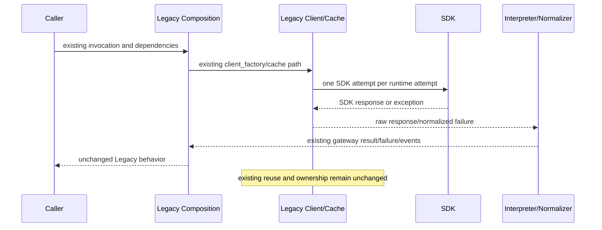
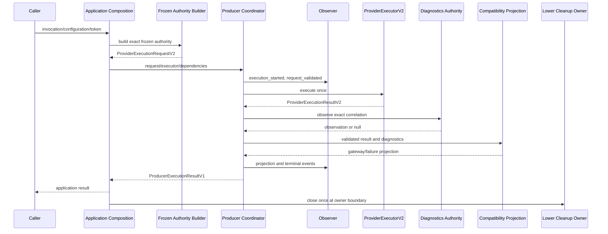
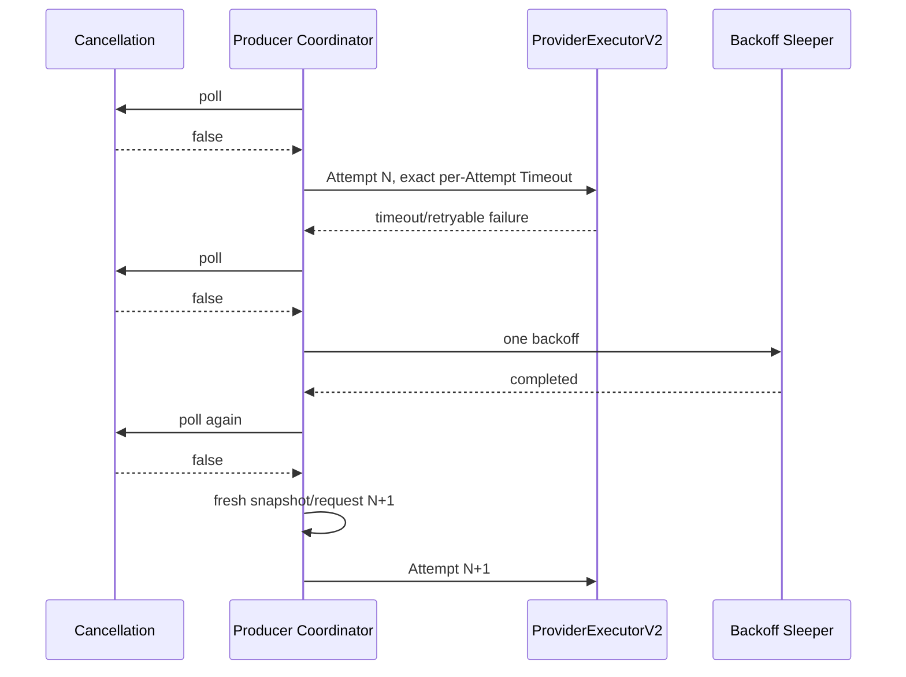
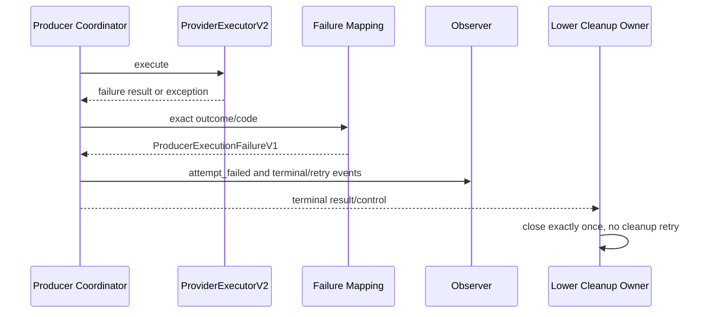

# Module 3.1 — Producer Compatibility Specification V1

Status: **normative specification — ready for specification review**

Baseline: `module-3.0-r3-verified` / `bf6016b4843b558b542eb901e64acef7c6b15f1a`

Frozen dependency: `module-2.9-complete` / `ed5ecb8035a504b6dc9b07f09576f7b8149629c9`

## 1. Normative language

The key words **MUST**, **MUST NOT**, **SHALL**, **SHALL NOT**, and **MAY** in
this specification are normative:

- **MUST** and **SHALL** require the stated behavior.
- **MUST NOT** and **SHALL NOT** prohibit the stated behavior.
- **MAY** permits the stated behavior without requiring it.

Normative requirements apply to the Neutral API only unless a requirement names
the Legacy API. Informative examples appear only in Appendix A.

## 2. Terminology

| Term | Exact definition |
|---|---|
| **Producer** | The application-owned controlled-revision subsystem currently implemented below `pastila_scout.editor.generation` |
| **Compatibility Layer** | The future Module 3.1 application package that validates Producer authority, invokes one injected `ProviderExecutorV2` per Attempt, and projects the result |
| **Legacy API** | The existing OpenAI Producer adapter, composition, client, interpreter, normalizer, models, signatures, exports, behavior, and default routing |
| **Neutral API** | The additive Module 3.1 API specified here; it contains no SDK or provider-runtime type |
| **ProviderExecutionV2** | The frozen public contracts exported by `pastila_scout.provider_execution_v2` |
| **Attempt** | Exactly one call to `ProviderExecutorV2.execute` plus its validated request, result, measurement, diagnostics observation, failure projection, and observer events |
| **Lifecycle** | The ordered, closed state sequence owned by the Producer coordinator for one Neutral API execution |
| **Diagnostics** | Safe metadata whose value and per-field provenance are represented by `ProducerExecutionDiagnosticsV1` |
| **Authority** | The single artifact or component permitted to produce a field without inference or substitution |
| **Projection** | Deterministic transformation from a validated frozen result into application-owned contracts |
| **Aggregation** | Deterministic construction of execution-level fields from the ordered Attempt tuple |
| **Retry** | A Producer-authorized new Attempt following a retryable failed Attempt and one backoff interval |
| **Timeout** | The per-Attempt seconds budget represented by `TimeoutPolicyV2`; it is not a total-operation deadline |
| **Cancellation** | A caller-owned live boolean authority polled by Producer and copied into a fresh immutable snapshot for each Attempt |
| **Observer** | An optional application-owned sink receiving only the events specified in section 15 |
| **Compatibility Boundary** | `Producer -> Compatibility Layer -> ProviderExecutorV2 -> frozen Module 2.9` |

These terms MUST retain these meanings throughout implementation and review.

## 3. Architecture and dependency rules

```text
Producer
   |
   v
Compatibility Layer (application-owned)
   |
   v
ProviderExecutorV2 / ProviderExecutionRequestV2 / ProviderExecutionResultV2
   |
   v
Frozen Module 2.9
```

The Compatibility Layer MUST depend only on frozen public Module 2.9 contracts.
Module 2.9 MUST NOT import Producer or Module 3.1. The Neutral API MUST NOT
import an SDK, provider runtime, provider bridge, provider execution package,
credential adapter, private Module 2.9 helper, or Legacy API module.

The Legacy API MUST remain unchanged and MUST remain the default during Phases
A and B. The Neutral API MUST use a separate explicit composition entry point.
No fallback, silent dispatch, implicit provider lookup, or service locator MAY
connect the two paths.

## 4. Common contract rules

Every V1 contract specified below MUST:

1. be immutable and reject additional fields;
2. validate retained state on construction and nested reconstruction;
3. require exact built-in primitives and reject subclasses, coercion, padding,
   non-finite numbers, mutable collections, and unknown enum values;
4. store ordered collections as tuples;
5. normalize every string to Unicode NFC before validation;
6. serialize as UTF-8 canonical JSON with `ensure_ascii=false`, no insignificant
   whitespace, keys sorted by Unicode code point, enum values serialized as
   strings, tuples serialized as arrays, and datetimes serialized as UTC RFC
   3339 with exactly six fractional digits and suffix `Z`;
7. compare equal exactly when all declared fields compare equal after strict
   reconstruction;
8. expose no credential, raw exception, traceback, client, executor, raw
   provider result, SDK response, or provider-specific object.

### 4.1 Canonical fingerprint and reference

Each fingerprinted V1 contract MUST use the following exact canonical payload:

| Contract | Canonical payload fields excluded |
|---|---|
| `ProducerExecutionRequestV1` | `request_reference`, `request_fingerprint` |
| `ProducerExecutionAttemptV1` | `attempt_reference`, `attempt_fingerprint` |
| `ProducerExecutionResultV1` | `result_reference`, `result_fingerprint` |

Every other declared field of that contract MUST appear in its canonical payload.
No field other than the two fields enumerated for that contract MAY be excluded.
Its fingerprint MUST be lowercase hexadecimal SHA-256 over the UTF-8 bytes of
that payload. Its reference MUST equal:

```text
scout:producer-compat:<artifact-kind>:<fingerprint>
```

`artifact-kind` MUST be the exact kebab-case kind defined for that contract.
Reconstruction MUST recompute both values and MUST reject mismatch. Timestamps
are semantic only where explicitly declared; no runtime-generated timestamp is
part of a V1 fingerprint.

### 4.2 Absence

Optional fields MUST use explicit `null`. Empty strings, zero, empty objects,
placeholder values, configured-value substitution, and sentinel strings MUST
NOT represent absence. Required tuples MAY be empty only where the contract
explicitly permits an empty tuple.

An exact string MUST be a built-in NFC string, 1–200 Unicode scalar values,
equal to its stripped value, and free of C0/C1 controls, surrogates, line breaks,
NUL, and the case-insensitive tokens `authorization`, `bearer `, `api_key`,
`credential`, `password`, `secret`, `traceback`, `cookie`, `c:\`, and `/home/`.
A SHA-256 field MUST match `^[0-9a-f]{64}$`. A canonical nonnegative decimal
string MUST match `^(0|[1-9][0-9]*)(\.[0-9]*[1-9])?$`; exponent notation,
leading zeros, trailing fractional zeros, sign characters, NaN and infinity
MUST be rejected. A JSON float MUST use the shortest round-trip finite JSON
number representation, and negative zero MUST be rejected. Nested Pydantic
contracts MUST enter canonical JSON through their strict Python-mode field dump;
their private and computed attributes MUST NOT enter serialization.

## 5. Contract specifications

### 5.1 `ProducerExecutionRequestV1`

Artifact kind: `execution-request-v1`.

| Field | Type | Presence | Authority / producer | Consumer | Construction and validation |
|---|---|---|---|---|---|
| `contract_version` | literal `producer-execution-request-v1` | Required | Compatibility composition | Validator | MUST equal literal |
| `request_reference` | canonical reference | Required | Compatibility composition | All Neutral components | MUST follow section 4.1 |
| `request_fingerprint` | SHA-256 | Required | Compatibility composition | All Neutral components | MUST follow section 4.1 |
| `invocation_reference` | exact string | Required | `ControlledRevisionInvocation` | Projection | MUST equal exact upstream reference |
| `invocation_fingerprint` | SHA-256 | Required | `ControlledRevisionInvocation` | Projection | MUST equal exact upstream fingerprint |
| `provider_request` | `ProviderExecutionRequestV2` | Required | Application authority composition | Executor | MUST be strictly reconstructed and lineage-bound |
| `retry_policy` | existing `AIRetryPolicy` | Required | Producer configuration | Coordinator | MUST be strictly reconstructed |

The semantic payload MUST exclude exactly `request_reference` and
`request_fingerprint` and MUST include every other declared request field.
The Compatibility Layer MUST NOT construct lower provider authority from prompt
text, provider name, model, endpoint, or credentials.

### 5.2 `ProducerTokenUsageV1`

| Field | Type | Presence | Authority | Construction and invariants |
|---|---|---|---|---|
| `prompt_tokens` | exact nonnegative integer or null | Optional | Diagnostics Authority | MUST be copied exactly |
| `completion_tokens` | exact nonnegative integer or null | Optional | Diagnostics Authority | MUST be copied exactly |
| `total_tokens` | exact nonnegative integer or null | Optional | Diagnostics Authority | When all three counts exist, MUST equal prompt plus completion |
| `estimated_cost` | exact finite nonnegative decimal string or null | Optional | Diagnostics Authority | MUST be copied exactly; floating-point cost is forbidden |
| `pricing_version` | exact string or null | Optional | Diagnostics Authority | MUST exist exactly when `estimated_cost` exists |

At least one token count or cost MUST exist. This value MUST NOT contain an
authority field; authority belongs to the containing diagnostic field. The
Diagnostics Authority MUST produce every field, and Attempt projection plus
Aggregation MUST consume every field.

### 5.3 `ProducerFinishMetadataV1`

| Field | Type | Presence | Authority | Construction and invariants |
|---|---|---|---|---|
| `source_request_reference` | exact string | Required | Provider result output | MUST copy exact source reference |
| `ordinal` | exact nonnegative integer | Required | Provider result output | MUST copy exact ordinal |
| `finish_reason` | `ProviderFinishReasonV2` | Required | Provider result output | MUST copy exact enum value |

The tuple containing these values MUST preserve provider-output order and MUST
have contiguous ordinals beginning at zero. Provider-result Projection MUST
produce every field; Attempt projection, gateway reconstruction, Aggregation,
and reporting MUST consume them.

### 5.4 `ProducerExecutionFailureV1`

| Field | Type | Presence | Authority | Construction and invariants |
|---|---|---|---|---|
| `failure_kind` | `AIProviderExecutionFailureKind` | Required | Failure table | MUST equal section 14 mapping |
| `diagnostic_code` | `ProducerFailureCodeV1` | Required | Failure table | MUST equal controlled code |
| `safe_message` | exact controlled string | Required | Failure table | MUST equal message paired with code |
| `retryable` | exact boolean | Required | Failure table | MUST equal section 14 mapping |
| `source_outcome` | `ExecutionOutcomeV2` or null | Optional | Validated lower result | MUST be null exactly when no valid lower result exists, including pre-dispatch failure and post-dispatch exception/malformed result |
| `source_failure_code` | exact safe string or null | Optional | Validated lower result | MUST copy exact lower code when present; MUST NOT expose lower message |

`ProducerFailureCodeV1` MUST contain exactly the codes in section 14. Equality
and serialization MUST follow section 4. The Compatibility failure projector
MUST produce every field. Attempt construction, Aggregation, Retry evaluation,
Observer projection, and callers MUST consume them.

### 5.5 `ProducerExecutionDiagnosticsV1`

| Field | Type | Presence | Authority | Invariant |
|---|---|---|---|---|
| `usage` | `ProducerTokenUsageV1` or null | Optional | Producer coordinator | MUST aggregate Attempt observations under section 13; null MUST pair with unavailable |
| `usage_authority` | `ProducerDiagnosticAuthorityV1` | Required | Projection | Non-null MUST equal `producer_coordinator` |
| `latency_ms` | exact finite nonnegative decimal string or null | Optional | Producer coordinator | MUST aggregate Attempt measurements under section 13; null MUST pair with unavailable |
| `latency_authority` | authority enum | Required | Projection | Non-null MUST equal `producer_coordinator` |
| `provider_request_id` | exact safe string or null | Optional | Diagnostics Authority | Null MUST pair with unavailable |
| `provider_request_id_authority` | authority enum | Required | Projection | Non-null MUST equal application authority |
| `returned_model_id` | exact safe string or null | Optional | Diagnostics Authority | Configured model substitution MUST NOT occur |
| `returned_model_id_authority` | authority enum | Required | Projection | Non-null MUST equal application authority |
| `finish_metadata` | tuple of `ProducerFinishMetadataV1` | Required | Provider result | MUST equal terminal Attempt metadata |
| `finish_metadata_authority` | authority enum | Required | Projection | MUST equal provider result when the terminal Attempt has a valid lower result; otherwise unavailable |
| `retryable` | exact boolean or null | Optional | Failure table | MUST be null on success and boolean on failure |
| `retryability_authority` | authority enum | Required | Projection | MUST equal unavailable on success, producer coordinator on failure |
| `attempt_count` | exact nonnegative integer | Required | Producer coordinator | MUST equal length of result attempts |
| `attempt_count_authority` | authority enum | Required | Projection | MUST equal `producer_coordinator` |
| `lifecycle_state` | terminal lifecycle enum | Required | Producer coordinator | MUST equal lifecycle terminal state |
| `lifecycle_authority` | authority enum | Required | Projection | MUST equal `producer_coordinator` |

`ProducerDiagnosticAuthorityV1` MUST contain exactly:
`application_diagnostics_authority`, `compatibility_clock`, `provider_result`,
`producer_coordinator`, and `unavailable`. No aggregate or mixed authority MAY
exist.

The named Authority in each row MUST be that row's Producer. Attempt/result
validation and reporting MUST consume every row; the Retry decider MUST consume
only `retryable`, and gateway reconstruction MUST consume only finish metadata.

### 5.6 `ProducerAttemptDiagnosticsV1`

| Field | Type | Presence | Authority | Invariant |
|---|---|---|---|---|
| `usage` | `ProducerTokenUsageV1` or null | Optional | Diagnostics Authority | Null MUST pair with unavailable |
| `usage_authority` | authority enum | Required | Projection | Non-null MUST equal application diagnostics authority |
| `latency_ms` | canonical nonnegative decimal string or null | Optional | Compatibility Clock | Null MUST pair with unavailable |
| `latency_authority` | authority enum | Required | Projection | Non-null MUST equal compatibility clock |
| `provider_request_id` | exact safe string or null | Optional | Diagnostics Authority | Null MUST pair with unavailable |
| `provider_request_id_authority` | authority enum | Required | Projection | Non-null MUST equal application diagnostics authority |
| `returned_model_id` | exact safe string or null | Optional | Diagnostics Authority | Null MUST pair with unavailable |
| `returned_model_id_authority` | authority enum | Required | Projection | Non-null MUST equal application diagnostics authority |
| `finish_metadata` | tuple of finish metadata | Required | Provider result | MUST preserve exact Attempt output order |
| `finish_metadata_authority` | authority enum | Required | Projection | MUST equal provider result for a valid lower result and unavailable when no valid lower result exists |

This contract MUST contain no aggregate attempt count, aggregate Retry state, or
overall Lifecycle state. The authorities named in the table MUST produce their
fields. Attempt construction MUST consume all fields, and execution Aggregation
MUST consume usage, latency, provider identifiers, and finish metadata.

### 5.7 `ProducerExecutionAttemptV1`

Artifact kind: `execution-attempt-v1`.

Its canonical payload MUST exclude exactly `attempt_reference` and
`attempt_fingerprint` and MUST include every other declared Attempt field.

| Field | Type | Presence | Authority / producer | Construction and invariant |
|---|---|---|---|---|
| `contract_version` | literal `producer-execution-attempt-v1` | Required | Coordinator | Fixed literal |
| `attempt_reference` | canonical reference | Required | Coordinator | Section 4.1 |
| `attempt_fingerprint` | SHA-256 | Required | Coordinator | Section 4.1 |
| `attempt_number` | exact positive integer | Required | Coordinator | MUST equal tuple index plus one |
| `execution_request_id` | exact string | Required | Attempt request context | MUST copy exact ID |
| `request_envelope_identity` | exact identity | Required | Attempt request | MUST copy exact identity |
| `timeout_seconds` | exact finite positive built-in integer or float | Required | Attempt timeout policy | MUST preserve type and numeric value without unit conversion; negative zero MUST be rejected |
| `cancellation_requested` | exact boolean | Required | Fresh Attempt snapshot | A dispatched Attempt MUST contain false |
| `outcome` | `ExecutionOutcomeV2` or null | Optional | Validated lower result | MUST be null only when the executor raises or returns no valid result after dispatch |
| `succeeded` | exact boolean | Required | Projection | MUST follow section 12 |
| `failure` | failure or null | Optional | Failure table | MUST be null exactly when succeeded |
| `diagnostics` | `ProducerAttemptDiagnosticsV1` | Required | Projection | MUST contain only Attempt-local values |

The fingerprint MUST bind the exact timeout and cancellation snapshot. One
Attempt MUST correspond to exactly one executor call. Pre-dispatch cancellation
or validation failure MUST produce no Attempt. `succeeded` MUST be true exactly
when a validated lower result has outcome `COMPLETED` and provider-result status
`SUCCESS`. A later gateway Projection failure MUST NOT rewrite that Attempt;
the overall result MUST fail while retaining the successful provider Attempt.
The Producer coordinator MUST produce every field after consuming the validated
Attempt request, lower result, failure mapping, and Attempt diagnostics. Result
Aggregation, Lifecycle, Observer projection, and callers MUST consume the
immutable Attempt.

### 5.8 `ProducerExecutionLifecycleV1`

| Field | Type | Presence | Authority | Invariant |
|---|---|---|---|---|
| `contract_version` | literal `producer-execution-lifecycle-v1` | Required | Coordinator | Fixed literal |
| `states` | tuple of lifecycle states | Required | Coordinator | MUST follow section 9 |
| `terminal_state` | `succeeded`, `failed`, or `cancelled` | Required | Coordinator | MUST equal last state |

Equality and serialization MUST follow section 4. Lifecycle MUST NOT contain an
identity, timestamp, diagnostic value, or inferred provider state. The Producer
coordinator MUST produce every field; result construction, diagnostics
Aggregation, Observer projection, and callers MUST consume them.

### 5.9 `ProducerExecutionResultV1`

Artifact kind: `execution-result-v1`.

Its canonical payload MUST exclude exactly `result_reference` and
`result_fingerprint` and MUST include every other declared result field.

| Field | Type | Presence | Classification / authority | Construction |
|---|---|---|---|---|
| `contract_version` | literal `producer-execution-result-v1` | Required | Application-owned | Fixed literal |
| `result_reference` | canonical reference | Required | Application-owned | Section 4.1 |
| `result_fingerprint` | SHA-256 | Required | Application-owned | Section 4.1 |
| `request_reference` | exact string | Required | Direct request projection | Exact request reference |
| `request_fingerprint` | SHA-256 | Required | Direct request projection | Exact request fingerprint |
| `invocation_reference` | exact string | Required | Direct request projection | Exact invocation reference |
| `invocation_fingerprint` | SHA-256 | Required | Direct request projection | Exact invocation fingerprint |
| `status` | `AIProviderExecutionStatus` | Required | Lifecycle projection | Section 12 |
| `gateway_result` | existing gateway result or null | Optional | Producer reconstructor | Non-null exactly on success |
| `diagnostics` | diagnostics | Required | Aggregation | Section 13 |
| `failure` | failure or null | Optional | Failure table | Non-null exactly on failed/cancelled |
| `attempts` | tuple of attempts | Required | Producer coordinator | Ordered and contiguous; MAY be empty before dispatch |
| `lifecycle` | lifecycle | Required | Producer coordinator | Section 9 |

The result MUST NOT retain a lower request/result, executor, diagnostics source,
clock, observer, token, SDK object, exception, client, runtime, or credential.
The Producer coordinator MUST produce the reference, fingerprint, direct lineage,
status, Attempts, Lifecycle, and aggregate diagnostics. Compatibility Projection
MUST produce failure and gateway result. Neutral callers and reporting MUST
consume the completed result.

### 5.10 Phase A public surface

The Phase A package MUST be
`pastila_scout.editor.generation.provider_compatibility_v1`. Its `__all__` MUST
contain exactly these symbols in this order:

```text
ProducerCompatibilityConfigurationError
ProducerCompatibilityClockV1
ProducerCompatibilityEventCodeV1
ProducerCompatibilityEventV1
ProducerCompatibilityObserverV1
ProducerDiagnosticAuthorityV1
ProducerDiagnosticsAuthorityV1
ProducerDiagnosticsObservationV1
ProducerExecutionAttemptV1
ProducerExecutionDiagnosticsV1
ProducerExecutionFailureV1
ProducerExecutionLifecycleStateV1
ProducerExecutionLifecycleV1
ProducerExecutionRequestV1
ProducerExecutionResultV1
ProducerFailureCodeV1
ProducerFinishMetadataV1
ProducerAttemptDiagnosticsV1
ProducerTokenUsageV1
```

Phase A MUST NOT export a coordinator, executor, provider adapter, runtime,
factory, cache, Projection implementation, composition implementation, or
migration switch. Phase A MUST contain an application-owned internal composition
seam and an application-owned internal Projection boundary as specified in
section 18. These internal boundaries MUST NOT extend the exact public surface
above. Phase B MAY activate them only through its separately reviewed additive
public surface.

## 6. Field authority matrix

| Field | Authority | Producer | Consumer | Derived? | Optional? | Fabrication permitted? | Validation rule |
|---|---|---|---|---:|---:|---:|---|
| Request invocation lineage | Upstream invocation | Compatibility composition | Projection | No | No | No | Exact equality |
| Frozen provider request | Application authority composition | Composition root | Executor | No | No | No | Strict reconstruction and full lineage |
| Attempt usage | Diagnostics Authority | Authority adapter | Attempt projection | No | Yes | No | Exact correlated observation |
| Execution usage | Producer coordinator | Coordinator | Reporting | Aggregated | Yes | No | Exact section 13 algorithm |
| Attempt latency | Compatibility Clock | Coordinator | Attempt projection | Measured | Yes | No | Two valid monotonic samples |
| Execution latency | Producer coordinator | Coordinator | Reporting | Aggregated | Yes | No | Exact section 13 algorithm |
| Provider request ID | Diagnostics Authority | Authority adapter | Reporting | No | Yes | No | Exact correlated observation |
| Returned model ID | Diagnostics Authority | Authority adapter | Reporting | No | Yes | No | Exact correlated observation |
| Finish metadata | Provider result | Projection | Reconstructor/reporting | Direct | No | No | Ordered exact outputs |
| Retryability | Failure table | Coordinator | Retry decider | Yes | Success only | No | Exact code/outcome mapping |
| Attempt count | Attempts tuple | Coordinator | Reporting | Yes | No | No | Exact tuple length |
| Lifecycle state | Lifecycle | Coordinator | Caller/reporting | Yes | No | No | Exact terminal state |
| Failure | Failure table | Projection | Caller/retry | Yes | Success only | No | Exact table row |
| Gateway result | Producer reconstructor | Projection | Caller | Yes | Failure only | No | Strict DTO and lineage validation |

Exactly one Authority MUST produce each field. A downstream consumer MUST NOT
replace missing authority with a configured, guessed, normalized, or synthesized
value.

## 7. Diagnostics Authority and Clock protocols

### 7.1 `ProducerDiagnosticsAuthorityV1`

The composition root MAY inject one object satisfying this exact protocol:

```text
observe(
    *,
    correlation_id: str,
    attempt_number: int,
    execution_request_id: str,
    request_envelope_identity: str,
    result: ProviderExecutionResultV2,
) -> ProducerDiagnosticsObservationV1 | None
```

`ProducerDiagnosticsObservationV1` MUST contain:

```text
contract_version = "producer-diagnostics-observation-v1"
correlation_id: exact input correlation ID
attempt_number: exact input number
execution_request_id: exact input ID
request_envelope_identity: exact input identity
usage: ProducerTokenUsageV1 | None
provider_request_id: exact safe string | None
returned_model_id: exact safe string | None
```

The coordinator MUST call `observe` exactly once after strict lower-result
validation and before result projection. It MUST NOT call it when dispatch did
not occur or lower-result validation failed. `correlation_id` MUST be lowercase
SHA-256 over UTF-8 canonical JSON of request fingerprint, Attempt number,
execution request ID, and envelope identity.

The same injected authority object MUST live for one coordinator execution and
MUST NOT be reused implicitly across executions. It MAY return null. It MAY
return any subset of its three optional values. The coordinator MUST validate
the entire observation. A foreign, stale, malformed, exceptional, or partially
invalid observation MUST be rejected as a whole and treated as null. Authority
failure MUST NOT alter execution outcome, retry, lifecycle, or projection.

The protocol MUST NOT inspect the lower result by reflection, execute a provider,
read credentials, or infer missing values. The coordinator MUST NOT cache or
reuse an observation across Attempts.

### 7.2 `ProducerCompatibilityClockV1`

The composition root MAY inject one clock satisfying:

```text
read_monotonic_ns() -> exact nonnegative int
```

For each Attempt, the coordinator MUST read once immediately before calling
`execute` and once in a `finally` boundary immediately after it returns or
raises. It MUST compute `(stop_ns - start_ns) / 1_000_000` as an exact decimal
string with at most six fractional digits, stripping trailing fractional zeros.
It MUST NOT round; it MUST truncate beyond six digits. A missing clock, wrong
type, exception, negative sample, or stop less than start MUST produce null
latency and `unavailable` authority without changing execution outcome. Wall
clock time MUST NOT substitute for this protocol.

## 8. Attempt and retry protocol

The Producer coordinator SHALL own the retry loop. The Compatibility Layer MUST
NOT retry. Module 2.9 MUST perform one lower execution per call.

For Attempt number `N`, the coordinator MUST perform in order:

1. poll Cancellation;
2. terminate cancelled with no Attempt if true;
3. construct a fresh cancellation snapshot and execution context;
4. construct and strictly validate a fresh provider request;
5. emit `attempt_started(N)` and append lifecycle `attempting`;
6. take the clock start sample;
7. invoke `execute` exactly once;
8. take the clock stop sample in `finally`;
9. validate result type, request ID, provider ID, envelope identity and lineage;
10. call Diagnostics Authority exactly once when result validation succeeds;
11. construct exactly one Attempt;
12. emit exactly one `attempt_succeeded(N)` or `attempt_failed(N)`;
13. poll Cancellation before Projection or Retry;
14. terminate cancelled if true;
15. project success, terminate failure, or evaluate Retry;
16. when Retry is authorized, emit retry/backoff events, sleep once, poll again,
    construct a new snapshot, and begin Attempt `N+1`.

Attempt numbers MUST be contiguous beginning at one. Attempt order MUST equal
tuple order. Failed Attempts MUST remain visible. Attempts MUST NOT be merged,
hidden, renumbered, replaced, or constructed for pre-dispatch failure.

Retry MUST require all of:

- failure retryable under section 14;
- exact corresponding `AIRetryPolicy` flag true;
- `N < maximum_attempts`;
- live Cancellation false before scheduling and after backoff.

The coordinator MUST emit one retry and two backoff events per authorized Retry.
Unknown failures MUST NOT retry. A lower executor MUST NOT be assumed to retry.

## 9. Lifecycle state machine

The exact states SHALL be:

```text
accepted
request_validated
attempting
attempt_succeeded
attempt_failed
retry_wait
projecting_result
succeeded
failed
cancelled
```

| Predecessor | Trigger | Owner | Successor | Observer event | Attempt relation |
|---|---|---|---|---|---|
| start | Neutral request accepted | Coordinator | `accepted` | `execution_started` | None |
| `accepted` | Authority valid | Coordinator | `request_validated` | `request_validated` | None |
| `accepted` | Authority invalid | Coordinator | `failed` | `execution_failed` | None |
| `accepted` | Cancellation true | Coordinator | `cancelled` | `execution_cancelled` | None |
| `request_validated` | Cancellation false and dispatch begins | Coordinator | `attempting` | `attempt_started` | New N |
| `request_validated` | Cancellation true | Coordinator | `cancelled` | `execution_cancelled` | None |
| `attempting` | Completed success projection available | Coordinator | `attempt_succeeded` | `attempt_succeeded` | Current N |
| `attempting` | Any non-success or dispatch/result failure | Coordinator | `attempt_failed` | `attempt_failed` | Current N |
| `attempt_succeeded` | Cancellation false | Coordinator | `projecting_result` | `projection_started` | Current N |
| `attempt_succeeded` | Cancellation true | Coordinator | `cancelled` | `execution_cancelled` | Current N retained |
| `projecting_result` | Gateway projection valid | Coordinator | `succeeded` | `execution_succeeded` | Current N terminal |
| `projecting_result` | Projection invalid | Coordinator | `failed` | `projection_failed`, then `execution_failed` | Current N terminal |
| `attempt_failed` | Lower outcome cancelled | Coordinator | `cancelled` | `execution_cancelled` | Current N terminal |
| `attempt_failed` | Live Cancellation true | Coordinator | `cancelled` | `execution_cancelled` | Current N terminal |
| `attempt_failed` | Retry authorized | Coordinator | `retry_wait` | `retry_scheduled`, then `backoff_started` | Current N retained |
| `attempt_failed` | Retry denied/exhausted | Coordinator | `failed` | `execution_failed` | Current N terminal |
| `retry_wait` | Sleep completes | Coordinator | `retry_wait` | `backoff_completed` | No new Attempt yet |
| `retry_wait` | Cancellation true after sleep | Coordinator | `cancelled` | `execution_cancelled` | No new Attempt |
| `retry_wait` | Cancellation false and fresh request valid | Coordinator | `attempting` | `attempt_started` | New N+1 |
| `retry_wait` | Fresh request invalid | Coordinator | `failed` | `execution_failed` | No new Attempt |

The self-transition on `retry_wait` MUST occur exactly once to record completed
backoff. No other self-transition is permitted. `succeeded`, `failed`, and
`cancelled` MUST be terminal. No event or Retry MAY occur after terminal state.
Diagnostics MUST NOT determine lifecycle state.

## 10. Timeout protocol

Producer configuration MUST express Timeout in seconds as an exact positive
finite built-in integer or float; negative zero MUST be rejected. Application authority composition MUST copy the
same numeric value into every fresh `TimeoutPolicyV2` without conversion,
rounding, multiplication, fallback, or reinterpretation.

Timeout MUST be per Attempt. There SHALL be no total-operation timeout in V1.
Backoff, validation, diagnostics, Projection, and Observer time MUST NOT consume
or reduce the next Attempt's timeout. Compatibility MUST create no timer or
deadline. The injected executor/lower runtime SHALL own the single enforcement.

Pre-dispatch Cancellation MUST take precedence over Timeout because no Attempt
occurs. When an Attempt returns `TIMEOUT`, the Attempt MUST retain timeout as its
outcome. The coordinator MUST then poll Cancellation: true MUST make the overall
result cancelled; false MUST permit timeout Retry evaluation. The final failure
MUST remain timeout when Retry is denied or exhausted.

Every Retry MUST reuse the same timeout value. Configuration mutation between
Attempts MUST be rejected because the immutable `ProducerExecutionRequestV1`
and retry policy are authoritative for the whole execution.

## 11. Cancellation protocol

The caller SHALL own one live Cancellation token exposing exactly
`is_cancelled() -> bool`. The coordinator MUST poll at the points defined in
section 8. A non-boolean value or token exception MUST fail closed as cancelled
without retaining the exception.

Each dispatched Attempt MUST contain a newly constructed
`CancellationTokenV2(cancellation_requested=False)`. A stale context, request,
or snapshot MUST NOT be reused. Compatibility MUST NOT claim mid-transport
cancellation. Cancellation after dispatch MUST be observed only at the next
polling point. Cancellation during backoff MUST be detected by the mandatory
post-backoff poll.

Pre-dispatch cancellation MUST create overall failure code
`producer_execution_cancelled`, `source_outcome=null`, no Attempt, and lifecycle
`accepted, cancelled` or `accepted, request_validated, cancelled` according to
the poll point. Lower `CANCELLED` MUST create one failed Attempt with
`source_outcome=cancelled` and overall terminal cancellation.

## 12. Result projection

Before Projection, the coordinator MUST strictly reconstruct the lower result
and verify exact request ID, provider ID, envelope identity, and complete request
lineage. A mismatch MUST become `provider_result_invalid` and MUST NOT invoke the
Diagnostics Authority or gateway reconstructor. Because dispatch occurred but
no valid lower outcome exists, this path MUST create one failed Attempt with
`outcome=null`, unavailable provider diagnostics, and any valid clock latency.

| Lower result | Attempt | Overall projection |
|---|---|---|
| `COMPLETED` + provider `SUCCESS` + valid outputs | `succeeded=true` | Reconstruct gateway; success if valid |
| `COMPLETED` + provider `PARTIAL` | `succeeded=false` | `provider_partial_result`; no gateway |
| `COMPLETED` + provider `FAILED` | `succeeded=false` | `provider_execution_failed`; no gateway |
| `PROVIDER_FAILURE` | `succeeded=false` | Map section 14 lower code |
| `TIMEOUT` | `succeeded=false` | `provider_timeout` |
| `CANCELLED` | `succeeded=false` | `producer_execution_cancelled` |
| `INTERNAL_EXECUTION_FAILURE` | `succeeded=false` | Map known safe code or `provider_internal_failure` |
| Executor raises public frozen configuration error | One failed Attempt with null outcome | `producer_execution_configuration_failed`; source outcome null |
| Executor raises any other exception | One failed Attempt with synthetic internal outcome prohibited | `provider_executor_contract_failed`; source outcome null |

Any executor exception after dispatch MUST create one Attempt whose `outcome`
field is impossible to source from a lower result; therefore
`ProducerExecutionAttemptV1.outcome` MUST be nullable exactly for this row. This
exception is the sole nullable Attempt outcome. No raw exception MAY escape.

Successful output units MUST be processed exactly once in tuple order. Source
references and ordinals MUST match the request units exactly. Zero, duplicate,
missing, foreign, reordered, partial, failed, length-limited, content-filtered,
or ambiguous outputs MUST NOT become success.

## 13. Aggregation specification

| Execution-level field | Exact aggregation algorithm |
|---|---|
| `attempts` | Ordered immutable tuple of every dispatched Attempt |
| `attempt_count` | Exact tuple length |
| `latency_ms` | Sum Attempt latency only when every Attempt has non-null latency; otherwise null |
| Token component | Sum component only when every Attempt has usage and that component non-null; otherwise null |
| `estimated_cost` | Sum only when every Attempt has non-null cost with one identical pricing version; otherwise null |
| `pricing_version` | Shared exact version when aggregate cost exists; otherwise null |
| `provider_request_id` | Terminal Attempt value only; no first-non-null or cross-Attempt fallback |
| `returned_model_id` | Terminal Attempt value only; no configured or cross-Attempt fallback |
| `finish_metadata` | Terminal Attempt tuple only |
| `retryable` | Final failure mapping only; null on success |
| `failure` | Final terminal failure only; prior failures remain in Attempts |
| `gateway_result` | Terminal successful Projection only |
| `observer events` | Emission order; MUST NOT be aggregated or reordered |
| `lifecycle` | Exact state append order |

If aggregate usage has no non-null token component and no aggregate cost, usage
MUST be null. Decimal latency and cost addition MUST use exact decimal arithmetic
without floating-point conversion. Aggregate authority MUST remain unavailable
when aggregate value is null.

When the final Attempt is retryable but `maximum_attempts` has been reached, the
overall failure MUST use `retry_exhausted`; the final Attempt MUST retain its
original mapped failure. The overall failure MUST copy the final Attempt's
`source_outcome` and `source_failure_code`. When Retry is denied by a disabled
policy flag, the overall failure MUST equal the final Attempt failure and MUST
retain that failure's `retryable=true` source classification while the Retry
decision remains false because policy denied it.

## 14. Failure specification

`ProducerFailureCodeV1` MUST contain exactly:

| Code | Failure kind | Safe message | Retryable | Policy flag / source |
|---|---|---|---:|---|
| `producer_request_invalid` | `PROJECTION` | `Producer execution request is invalid.` | No | Pre-dispatch validation |
| `producer_execution_configuration_failed` | `CONFIGURATION` | `Producer execution configuration failed.` | No | Frozen configuration error |
| `provider_executor_contract_failed` | `INTERNAL` | `Provider executor contract failed.` | No | Raised/non-result executor |
| `provider_result_invalid` | `MALFORMED_RESPONSE` | `Provider execution result is invalid.` | No | Lower validation/lineage |
| `provider_execution_failed` | `CLIENT` | `Provider execution failed.` | No | Generic provider failure |
| `provider_timeout` | `CLIENT` | `Provider execution timed out.` | Yes | `retry_timeouts` |
| `provider_rate_limited` | `CLIENT` | `Provider rate limit was reached.` | Yes | `retry_rate_limits` |
| `provider_transport_failed` | `CLIENT` | `Provider transport failed.` | Yes | `retry_transport_errors` |
| `provider_unavailable` | `CLIENT` | `Provider is unavailable.` | Yes | `retry_transport_errors` |
| `producer_execution_cancelled` | `CANCELLATION` | `Producer execution was cancelled.` | No | Live/lower cancellation |
| `provider_partial_result` | `INCOMPLETE_RESPONSE` | `Provider returned a partial result.` | No | Partial projection |
| `provider_refusal` | `REFUSAL` | `Provider refused the request.` | No | Controlled lower code/finish |
| `provider_length_limited` | `INCOMPLETE_RESPONSE` | `Provider output reached its length limit.` | No | Length finish reason |
| `provider_content_filtered` | `REFUSAL` | `Provider output was content filtered.` | No | Content-filter finish reason |
| `provider_output_invalid` | `SCHEMA` | `Provider output is invalid.` | No | Cardinality/schema/JSON |
| `gateway_projection_failed` | `INVALID_GATEWAY_PROJECTION` | `Gateway result projection failed.` | No | Reconstructor |
| `provider_internal_failure` | `INTERNAL` | `Provider execution failed internally.` | No | Unknown lower code/outcome |
| `retry_exhausted` | `RETRY_EXHAUSTED` | `Provider retries were exhausted.` | No | Retryable final Attempt at maximum |

Known lower failure codes `provider_timeout`, `provider_rate_limited`,
`provider_transport_failed`, `provider_unavailable`, `provider_refusal`,
`provider_length_limited`, and `provider_content_filtered` MUST map to the same
Producer code. Any other lower code MUST map by outcome to
`provider_execution_failed` or `provider_internal_failure` and MUST be
non-retryable. The exact lower safe code MUST remain only in
`source_failure_code`.

The Neutral API MUST expose failures as values. Pre-dispatch misuse MAY raise one
application-owned `ProducerCompatibilityConfigurationError` with fixed message
`Producer compatibility configuration is invalid.` It MUST suppress context and
cause and MUST retain no request, executor, token, clock, authority, or lower
exception. No SDK or Module 2.9 private error MAY cross the boundary.

## 15. Observer protocol

`ProducerCompatibilityObserverV1.emit(event)` MAY be injected. Observer failure
MUST be swallowed without changing execution. Events MUST contain exactly:

```text
event_code: ProducerCompatibilityEventCodeV1
request_reference: exact request reference
attempt_number: exact positive integer | null
diagnostic_code: ProducerFailureCodeV1 | null
lifecycle_state: exact state
```

The event-code set SHALL be:

```text
execution_started
request_validated
attempt_started
attempt_succeeded
attempt_failed
diagnostics_sampled
diagnostics_unavailable
diagnostics_rejected
retry_scheduled
backoff_started
backoff_completed
projection_started
projection_completed
projection_failed
timeout_detected
execution_succeeded
execution_failed
execution_cancelled
```

Events MUST be emitted synchronously in lifecycle/action order. For a valid
lower result the exact Attempt prefix MUST be `attempt_started`, then exactly one
of `diagnostics_sampled`, `diagnostics_unavailable`, or `diagnostics_rejected`,
then `attempt_succeeded` or `attempt_failed`. An invalid lower result or executor
exception MUST emit `attempt_started`, then `attempt_failed` and MUST emit no
diagnostics event. Every dispatched
Attempt MUST emit one start and exactly one succeeded/failed event. A timeout
MUST emit `attempt_failed`, then `timeout_detected`. Diagnostics MUST emit exactly
one of sampled, unavailable, or rejected after valid result validation. Retry MUST emit
scheduled, backoff started, then backoff completed. Successful Projection MUST
emit started, completed, then execution succeeded. Failed Projection MUST emit
started, failed, then execution failed. Cancellation MUST emit exactly one
terminal cancellation event. Pre-dispatch validation failure MUST emit started,
then execution failed. Event payload MUST contain a diagnostic code only for
attempt failure, timeout, projection failure, and terminal failure/cancellation.

The Neutral observer protocol is additive and MUST NOT impersonate Legacy
credential or SDK events. The Legacy observer and event sequence MUST remain
unchanged on the Legacy path.

## 16. Cache, reuse, lifetime, and cleanup

| Behavior | Classification | Owner | Scope/lifetime/key | Cleanup and parity rule |
|---|---|---|---|---|
| Legacy `WeakKeyDictionary` SDK-client cache | Preserve on Legacy; remove from Neutral | Legacy client | Existing credential-provider identity key and legacy composition lifetime | Legacy remains unchanged |
| Neutral client cache | Remove | None | No cache or key MAY exist | Compatibility MUST NOT cache |
| Executor reuse | Replace legacy cache behavior | Lower runtime composition | One exact executor object keyed by composition identity for one Neutral coordinator execution | Same object MUST serve every Retry |
| Runtime composition reuse | Preserve behaviorally | Application composition root | One composition instance for one Neutral coordinator execution | MUST NOT recompose per Attempt |
| Transport/session reuse | Preserve behaviorally | Lower runtime composition | Same client/session embedded in reused executor; lifetime equals composition | Lower owner MAY reuse internally |
| Credential association | Replace | Lower runtime composition | Bound before handoff; no Compatibility-visible key | Compatibility MUST NOT read or retain credentials |
| Provider cleanup | Preserve behaviorally | Lower runtime composition owner | Ownership begins after successful composition and ends after terminal coordinator return | Owner MUST close exactly once; no retry |
| Compatibility object lifetime | Application composition root | Application composition root | One execution | Contains no raw resource |
| Attempt lifetime | Producer result | Producer coordinator | Immutable result lifetime | No cleanup |

Failure before successful lower composition handoff MUST be cleaned by the
composition root that acquired each resource. Compatibility MUST NOT guess or
perform cleanup. Base exceptions after handoff MUST still return control to the
lower owner through its established `finally` boundary; cleanup failure MUST
follow the lower runtime's frozen lifecycle precedence.

## 17. Ownership specification

| Responsibility | Sole owner |
|---|---|
| Legacy API/default | Existing OpenAI Producer adapter |
| Neutral API | Module 3.1 Compatibility Layer |
| Deprecation/removal | Application release governance |
| Credentials/client construction | Lower runtime composition |
| Client/session reuse and cache | Lower runtime composition; Legacy cache remains Legacy-owned |
| Request authority | Application composition using frozen public authority |
| Execution | Injected `ProviderExecutorV2` |
| Retry policy, loop and backoff | Producer coordinator |
| Timeout intent | Producer configuration/application composition |
| Timeout enforcement | Injected executor/lower runtime |
| Live Cancellation and polling | Producer coordinator |
| Cancellation snapshot | Application request composition |
| Diagnostics observations | Injected Diagnostics Authority |
| Latency | Compatibility Clock/coordinator |
| Attempts and Aggregation | Producer coordinator |
| Lifecycle | Producer coordinator |
| Result and failure Projection | Compatibility Layer |
| Gateway reconstruction | Producer reconstructor |
| Observer events | Producer coordinator |
| Provider cleanup | Lower runtime composition owner |

No fallback or secondary owner MAY exist.

## 18. Migration specification

### Phase A — contracts, inert composition seam, and Projection boundary

- **Entry MUST require:** specification review verified; specification committed
  and tagged; frozen hashes/exports confirmed; Legacy tests green.
- **Allowed modifications SHALL be:** one new application-owned compatibility
  package containing exactly the section 5.10 public contracts/protocols; an
  internal composition seam accepting an injected `ProviderExecutorV2`, an
  authoritative `ProviderExecutionRequestV2`, Diagnostics Authority, Clock,
  Cancellation, Retry dependencies, and Observer; an internal pure
  result/failure Projection boundary; its tests, schemas, and this documentation.
- **Composition-seam constraints SHALL be:** the seam exists solely to support a
  future implementation; construction MUST perform no executor call, credential
  access, provider composition, client construction, networking, Retry, cleanup,
  or Legacy dispatch. It MUST NOT become the default execution path, modify
  Legacy Producer behavior, execute provider-neutral production traffic, or
  require any Module 2.9 change.
- **Projection-boundary constraints SHALL be:** Projection MAY be exercised only
  with inert authoritative fixtures during Phase A; it MUST perform no provider
  execution, Legacy routing, default switch, or migration.
- **Forbidden modifications SHALL include:** Legacy implementation/default,
  Module 2.9/3.0, provider/runtime/SDK packages, credentials and networking.
- **Tests MUST cover:** strict contracts, reconstruction, canonical JSON,
  fingerprinting, public exports, import isolation, and inert composition.
- **Exit MUST require:** focused/full gates and independent implementation review.
- **Commit gate MUST require:** reviewed diff limited to allowed files.
- **Tag gate MUST require:** a new immutable Phase A verified tag after review.
- **Rollback SHALL be:** removal of additive package/exports; Legacy unchanged.

### Phase B — opt-in coordinator and internal migration

- **Entry MUST require:** verified Phase A tag and approved fake executor corpus.
- **Allowed modifications SHALL be:** activation of the Phase A seam and
  Projection through a compatibility coordinator and tests behind the separate
  opt-in composition entry point; this SHALL be the first internal migration.
- **Forbidden modifications SHALL include:** Legacy default/deprecation, frozen
  packages, live providers, credentials and networking.
- **Tests MUST cover:** every state, event, failure, Attempt, Retry, Cancellation,
  Timeout, diagnostic, aggregation, reuse and cleanup rule.
- **Exit MUST require:** compatibility and full regression plus independent
  verification; the Legacy default MUST remain unchanged after exit.
- **Commit/tag gates MUST require:** reviewed allowed-scope diff, then immutable
  verified Phase B tag.
- **Rollback SHALL be:** disable/remove opt-in route and retain Legacy default.

### Phase C — explicit deprecation

- **Entry MUST require:** verified Phase B tag, caller inventory, production
  comparison evidence, diagnostic adoption decision, and tested rollback.
- **Allowed modifications SHALL be:** deprecation policy, warnings and migration
  documentation authorized by release governance.
- **Forbidden modifications SHALL include:** Legacy removal, silent default
  switch, frozen changes and behavior divergence.
- **Tests MUST cover:** warning/public API compatibility and rollback routing.
- **Exit MUST require:** every caller migration approved and independent review.
- **Commit/tag gates MUST require:** explicit release approval and immutable
  verified Phase C tag.
- **Rollback SHALL be:** remove deprecation signaling; Legacy remains available.

### Phase D — breaking-policy removal

- **Entry MUST require:** verified Phase C tag, completed compatibility window,
  zero remaining Legacy callers and explicit breaking-release authorization.
- **Allowed modifications SHALL be:** Legacy removal and corresponding public
  documentation in the breaking release only.
- **Forbidden modifications SHALL include:** frozen Module 2.9 changes and
  unverified replacement behavior.
- **Tests MUST cover:** final public API, migration, packaged rollback, full
  regression and absence of Legacy imports.
- **Exit MUST require:** independent review and release-governance approval.
- **Commit/tag gates MUST require:** reviewed breaking diff and immutable final
  migration tag.
- **Rollback SHALL be:** restore the previous verified release package; frozen
  Module 2.9 MUST remain untouched.

No phase MAY begin until its Entry requirements pass.

## 19. Normative sequence specifications

### 19.1 Legacy execution



### 19.2 Neutral execution, diagnostics, lifecycle and observer



### 19.3 Retry, timeout and cancellation



### 19.4 Failure and cleanup



The diagrams MUST be interpreted together with sections 8–17. A diagram MUST
NOT override a table or introduce an unlisted call.

## 20. Risk specification

| Risk | Probability | Impact | Owner | Mitigation | Verification |
|---|---|---|---|---|---|
| Diagnostics drift | Medium | High | Compatibility Layer | Per-field authority and exact correlation | Foreign/stale/partial/failure matrix |
| Timeout drift | Low | High | Application composition | One per-Attempt value and no timer | Exact value/call-count tests |
| Cancellation drift | Medium | High | Producer coordinator | Mandatory polls and fresh snapshots | Every polling boundary |
| Retry drift | Medium | High | Producer coordinator | Sole loop and fixed mapping | Outcome/policy/call-count matrix |
| Cache/reuse drift | Medium | High | Lower composition | One composition/executor per execution | Client/credential/close counts |
| Lifecycle drift | Medium | High | Producer coordinator | Closed transition table | Every edge and forbidden edge |
| Observer drift | Medium | High | Producer coordinator | Closed event set/order | Exact event traces for every path |
| Cleanup drift | Low | Critical | Lower composition owner | Sole owner and no Compatibility close | Failure/BaseException precedence matrix |
| SDK leakage | Low | Critical | Compatibility package | Public-only frozen imports | Import/dependency/object-graph scans |
| Failure mapping drift | Medium | High | Compatibility Layer | Frozen exhaustive V1 table | Every code/outcome and unknown case |
| Aggregation drift | Medium | High | Producer coordinator | Exact section 13 algorithms | Multi-Attempt property tests |
| Legacy divergence | Low | Critical | Existing Legacy adapter | Separate opt-in API | Signature/export/behavior snapshots |

## 21. Implementation readiness checklist

Phase A implementation MUST NOT begin until every **Begin gate** item is
satisfied:

- [ ] **Begin gate:** This specification has an independent `VERIFIED` verdict.
- [ ] **Begin gate:** The specification is committed and tagged as an immutable baseline.
- [ ] **Begin gate:** Frozen Module 2.9 and Module 3.0 hashes/exports are unchanged.
- [ ] **Begin gate:** Future code scope is limited to
  `src/pastila_scout/editor/generation/provider_compatibility_v1/`, its tests,
  additive package exports, generated schemas, and this documentation.

After the Begin gate passes, Phase A implementation MUST verify every following
item before its independent implementation review, commit, or tag:

- [ ] Every section 5 contract is strict, immutable, reconstructed, canonically
  serialized, fingerprinted where required, and provider-neutral.
- [ ] The internal composition seam accepts only the Phase A injected authorities
  and remains unreachable from Legacy/default production routing.
- [ ] The internal Projection boundary is pure and is exercised only with inert
  authoritative fixtures during Phase A.
- [ ] Diagnostics Authority and Clock exactly implement section 7.
- [ ] Attempts, Retry and Aggregation exactly implement sections 8 and 13.
- [ ] Lifecycle accepts every listed edge and rejects every unlisted edge.
- [ ] Timeout and Cancellation exactly implement sections 10 and 11.
- [ ] Failure mapping contains exactly the section 14 codes and messages.
- [ ] Observer emits exactly the section 15 event set, payload and order.
- [ ] Cache/reuse and cleanup ownership match section 16.
- [ ] Legacy signatures, exports, behavior and default routing remain unchanged.
- [ ] No credential, SDK, provider runtime, private helper or networking enters
  the Compatibility package.
- [ ] Focused, compatibility, full regression and quality gates pass.
- [ ] Independent implementation verification passes before Phase A commit/tag.

An unchecked Begin gate item MUST block implementation. Any other unchecked item
MUST block Phase A completion, commit, tag, or phase progression. No open question
MAY be resolved through inference, fallback, normalization, or fabricated data.

## 22. Explicit exclusions

This specification SHALL NOT implement or authorize Producer migration,
provider execution, credentials, clients, networking, cache construction,
runtime modification, Module 2.9/3.0 modification, Legacy deprecation, CLI/GUI,
or work on Scout, Ollama, Gemini, or Claude.

## Appendix A — Informative examples

This appendix is informative and does not alter normative behavior.

An execution with one successful Attempt has an Attempt count of one, terminal
finish metadata from that Attempt, and a successful lifecycle. An execution with
one timeout followed by one success retains both Attempts in order; its top-level
provider request ID and returned model come only from the successful terminal
Attempt. If either Attempt lacks latency, aggregate latency is absent.
